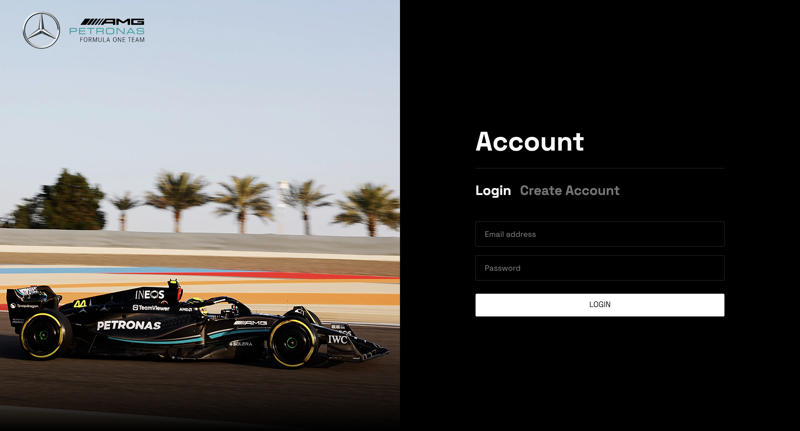
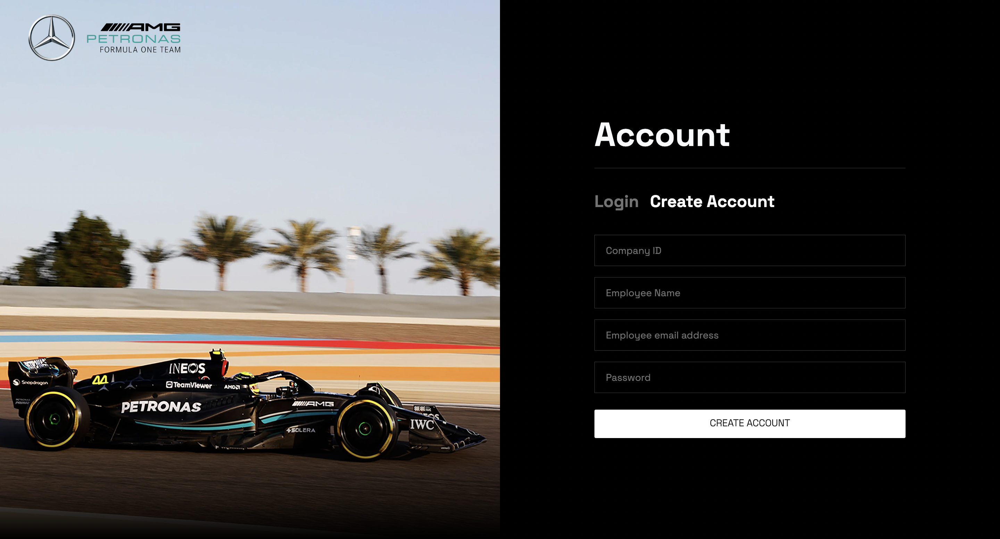
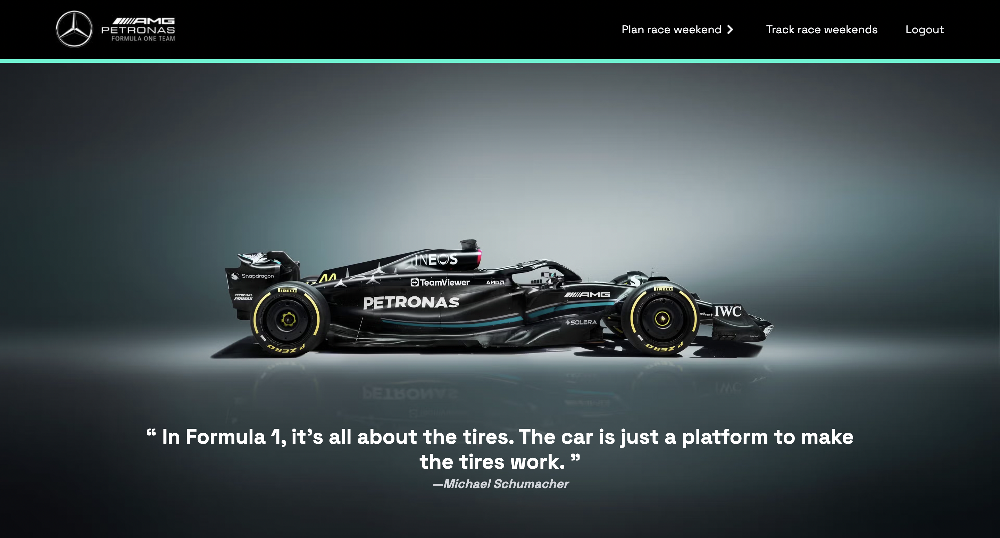
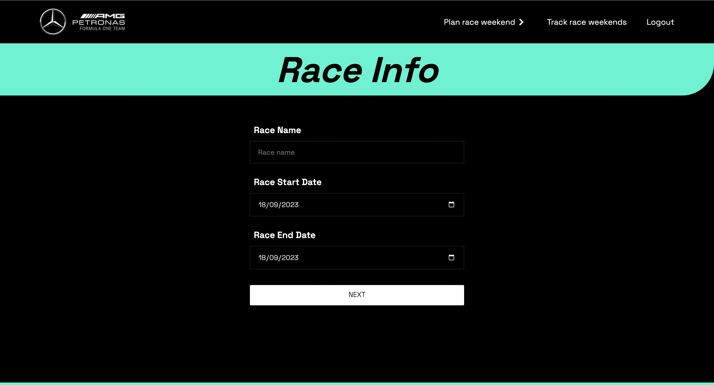
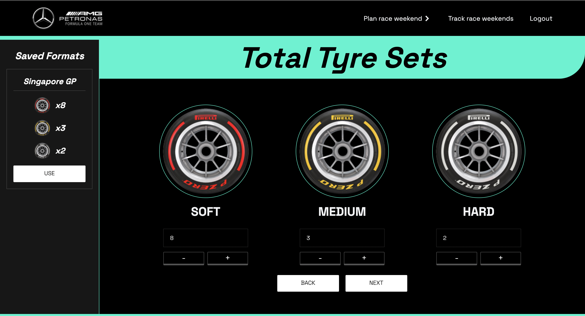
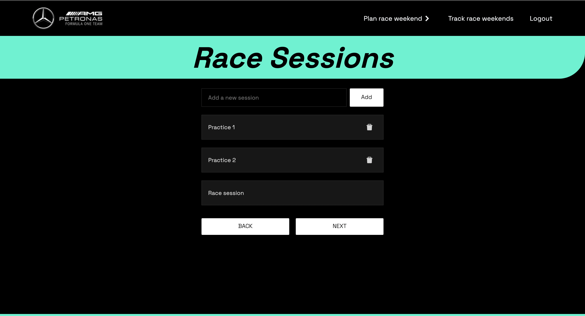
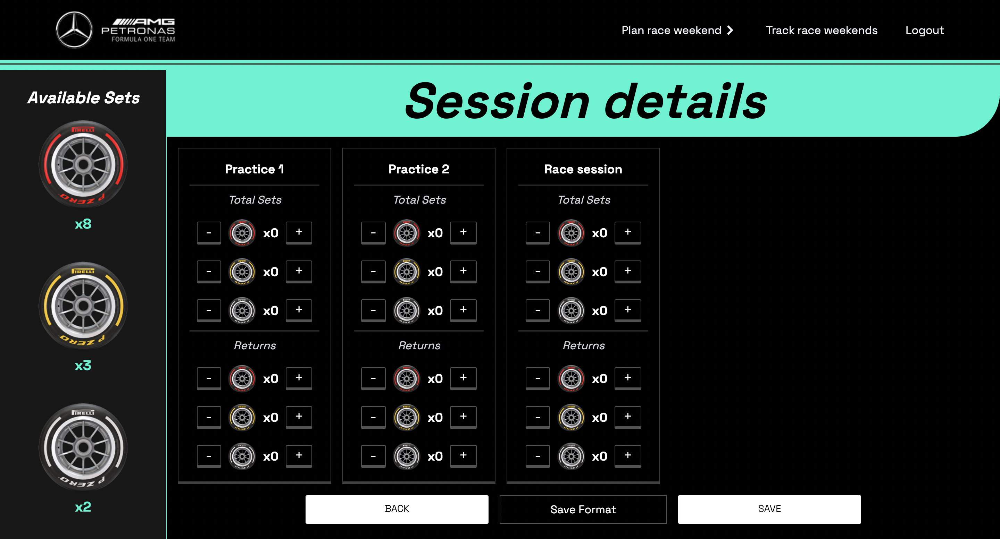
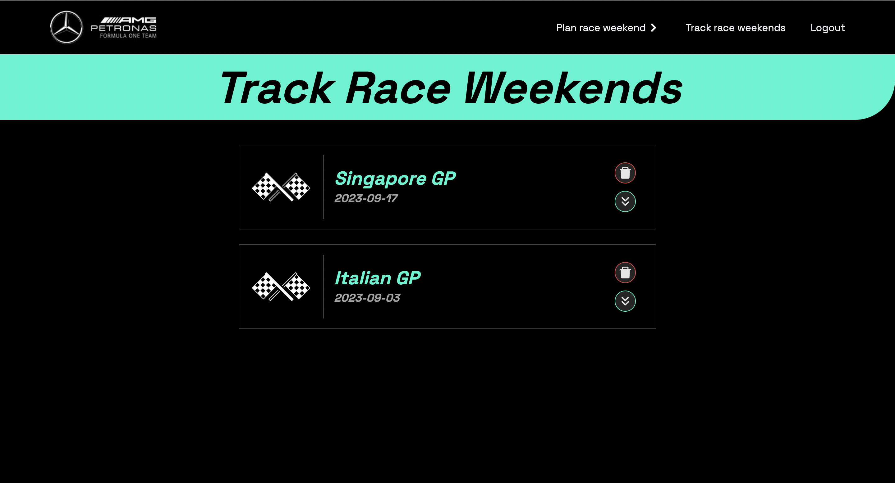

# Your Project Name

 <!-- Replace with your project logo -->

## Table of Contents

- [Introduction](#introduction)
- [Technologies Used](#technologies-used)
- [Functionalities](#functionalities)
- [Screenshots](#screenshots)
- [How to Use](#how-to-use)
- [Future Improvements](#future-improvements)

## Introduction

Welcome to the Mercedes F1 Team Tyre Management System, a cutting-edge solution designed to optimize and streamline the tire-related operations of one of the world's most renowned Formula 1 racing teams, Mercedes-AMG Petronas Formula One Team. In the high-stakes world of Formula 1 racing, where milliseconds can make the difference between victory and defeat, tire management plays a pivotal role. Our system empowers the Mercedes F1 Team to efficiently track, analyze, and manage tire performance throughout every race weekend. With a focus on data-driven insights and real-time decision-making, our Tyre Management System provides the competitive edge needed to maintain Mercedes' position at the forefront of Formula 1 excellence. Discover how our system revolutionizes tire management, enhances race strategy, and contributes to the team's ongoing success on the track.

## Technologies Used

List the technologies, programming languages, and tools used in your project. Include versions if applicable.

**Front-end (Mercedes F1 Team Tyre Management System):**

- **React**: A popular JavaScript library for building user interfaces.
- **Vite**: A build tool and development server that is particularly efficient for modern web development with features like hot module replacement (HMR).
- **Axios**: A promise-based HTTP client for making HTTP requests in the browser.
- **React-Beautiful-DND**: A library for adding drag-and-drop functionality to React applications.
- **React-Router-Dom**: A library for adding routing to React applications, allowing for navigation between different views.
- **React-Scroll**: A library for smooth scrolling behavior in React applications.

**Back-end (Server):**

- **Node.js**: A server-side JavaScript runtime for building scalable and efficient network applications.
- **Express**: A web application framework for Node.js, used for building RESTful APIs and web applications.
- **MongoDB Atlas**: A NoSQL database used for storing and managing data.
- **Mongoose**: An Object Data Modeling (ODM) library for MongoDB, making it easier to work with MongoDB in Node.js.
- **Bcrypt**: A library for hashing and salting passwords, enhancing security.
- **JSON Web Token (JWT)**: A library for creating and verifying JSON Web Tokens, used for authentication and authorization.
- **Cors**: A middleware for enabling cross-origin resource sharing, allowing client-side code to make requests to the server from different origins.
- **Dotenv**: A library for loading environment variables from a `.env` file, used for configuration.
- **Nodemon**: A utility that automatically restarts the Node.js server when code changes are detected during development.

**Other tools:**

- **Postman**

## Functionalities

- Functionality 1: Login and Registration with JWT middleware.
- Functionality 2: Drag and drop feature for adding race sessions.
- Functionality 3: Modern UI Design Inspired by Mercedes AMG F1 Website.
- Functionality 4: Adding Race name, race start date, race end date, tyres available of different types, allocate tyres among different sessions, save race format(Only UI and Api is implemented), list of all previous race weekends with details.

## Screenshots

_Caption for Screenshot 1_

_Caption for Screenshot 2_

## How to Use

Provide instructions on how to set up and run your project. Include any necessary steps for installation, configuration, or deployment.

2. Install dependencies: `npm install`
3. Configure environment variables: Create a `.env` file and set the necessary variables.
4. Start the application: `npm start`
5. Open your web browser and access the application at `http://localhost:3000`.

## Future Improvements

List of potential improvements, new features, or enhancements that you plan to implement in the future.

- Feature 1: SQL Can be used for the database, for better relation between data.
- Feature 2: Make a new collection for individual tyres to track the usage and allocation even more.
- Feature 3: Make UI improvements in the Race session details Screen and Track race weekends page.
- ...
